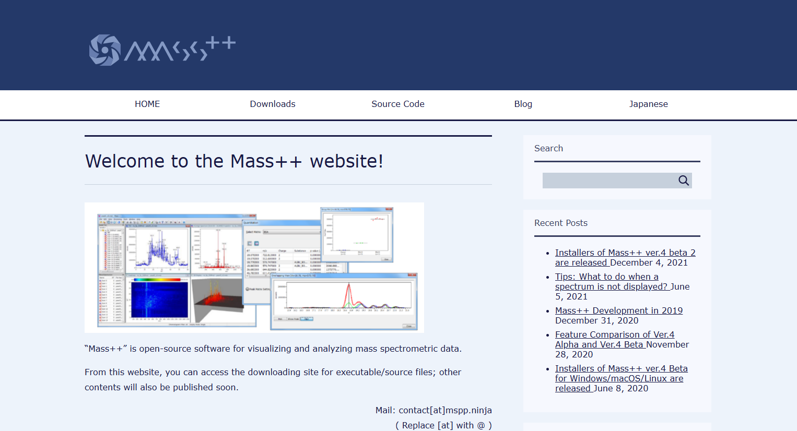
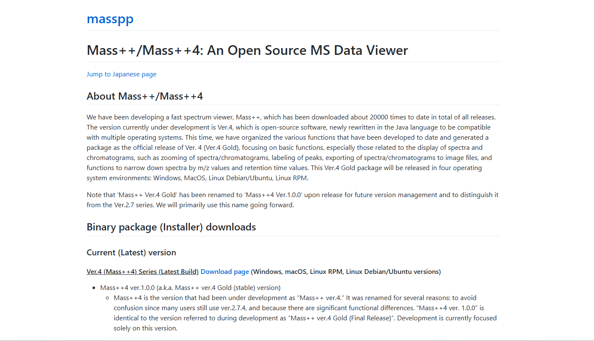
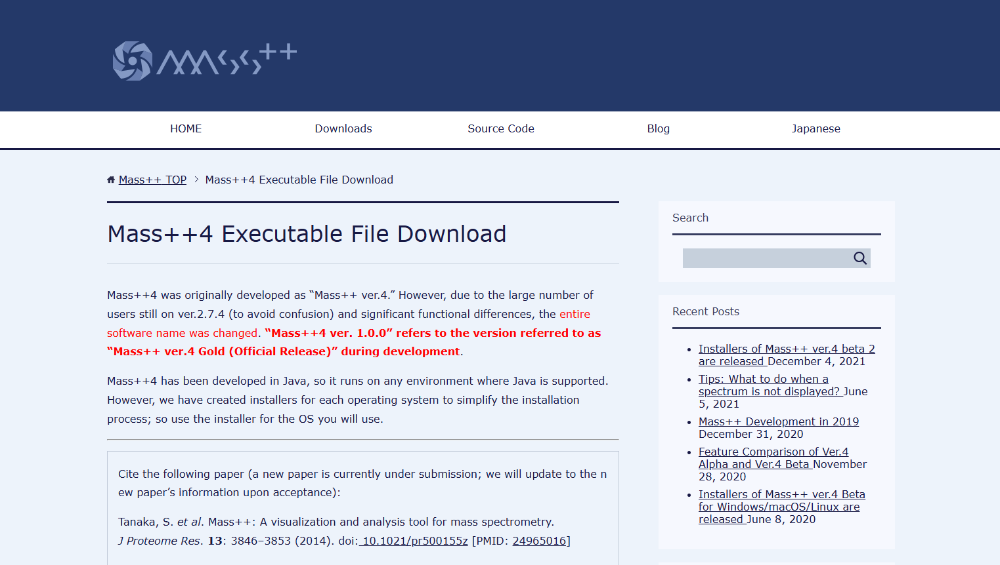

#  Installation

Mass++4 is distributed as a ready-to-install package for each platform. The
packages contain their own Java runtime, so Java does **not** have to be
installed separately.

##  Downloading the installer

1. Open the Mass++ website: <https://mspp.ninja/>
   Click **Downloads** in the menu at the top of the page.

   

2. The Mass++/Mass++4 portal at <https://develop.mspp.ninja/> opens.
   Go to **Binary package (Installer) downloads** -> **Current (Latest)
   version**, and click the **Download page** link of the
   *Ver.4 (Mass++4) Series (Latest Build)*.

   

3. The [Mass++4 Executable File Download](https://mspp.ninja/mass4-executable-file-download/)
   page opens. The top of the page also shows the Mass++ paper to cite when you
   publish results obtained with Mass++.

   

4. Scroll down to **Download of the installer**. Under the latest version, click
   **Download** of the package for your platform.

| Platform | Package on the page | Format |
| --- | --- | --- |
| Windows | `Mass++4 <version> (Windows)` | `.zip` (zipped `.exe`) |
| macOS | `Mass++4 <version> (MacOS)` | `.dmg` |
| Debian / Ubuntu | `Mass++4 <version> (Linux-Debian/Ubuntu)` | `.deb` |
| RHEL / AlmaLinux and other RPM distributions | `Mass++4 <version> (Linux-RPM)` | `.rpm` |

Older builds are listed further down the same page under
*[Mass++4 Installer - Previous Versions]*, and Mass++ ver.2 has its own download
page. Neither is covered by this manual.

The same installers are also attached to the releases in the source repository:
<https://github.com/masspp/mspp4-desktop/releases>

##  Windows

1. Extract the downloaded `.zip` file.
2. Run the installer (`.exe`) that it contains.
3. The installer lets you choose the installation folder and adds a Start menu
   entry and a desktop shortcut.
4. Start the application from the Start menu entry **Mass++4**.

##  macOS

1. Open the downloaded `.dmg` file.
2. Drag **Mass++4** into the `Applications` folder.
3. Start the application from the `Applications` folder.

If macOS refuses to open the application because it is not from an identified
developer, right-click the application icon, choose `Open`, and confirm.

##  Debian / Ubuntu

Install the downloaded package. Replace `<version>` with the version in the file
name.

```bash
sudo apt install ./ms++4_<version>_amd64.deb
```

##  RHEL / AlmaLinux

Install the downloaded package. Replace `<version>` with the version in the file
name, and use the package for your major version (`alma9` or `alma10`).

```bash
sudo dnf install ./ms++4-<version>-1.alma9.x86_64.rpm
```

##  Opening vendor raw files (optional)

Reading `.mzML` files works out of the box. Opening Thermo `.raw`, Sciex
`.wiff`, or Shimadzu `.lcd` files additionally requires **Docker Desktop** to be
installed and running, because Mass++4 converts those files to mzML with
ProteoWizard `msconvert` inside a Docker container.

<https://www.docker.com/products/docker-desktop/>

The first conversion downloads the converter image, so it takes longer than
later ones. If Docker is not running when you open such a file, Mass++4 shows a
message asking you to start Docker Desktop.

##  Building from source

To build Mass++4 yourself instead of using an installer, follow the
instructions in the `mspp4-desktop` repository:

<https://github.com/masspp/mspp4-desktop#how-to-develop>
