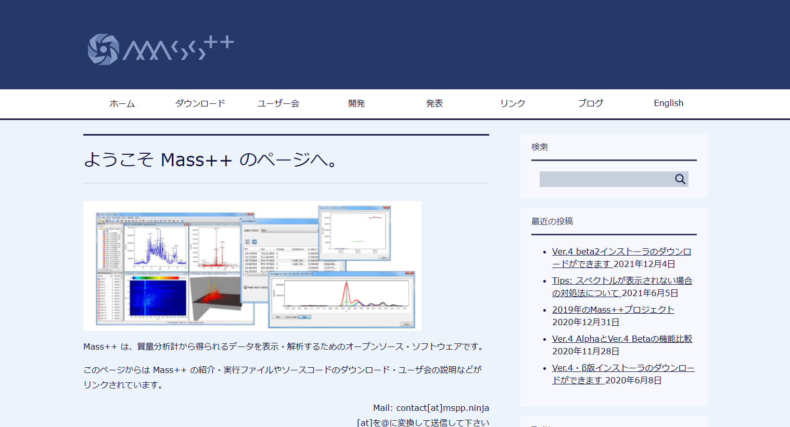
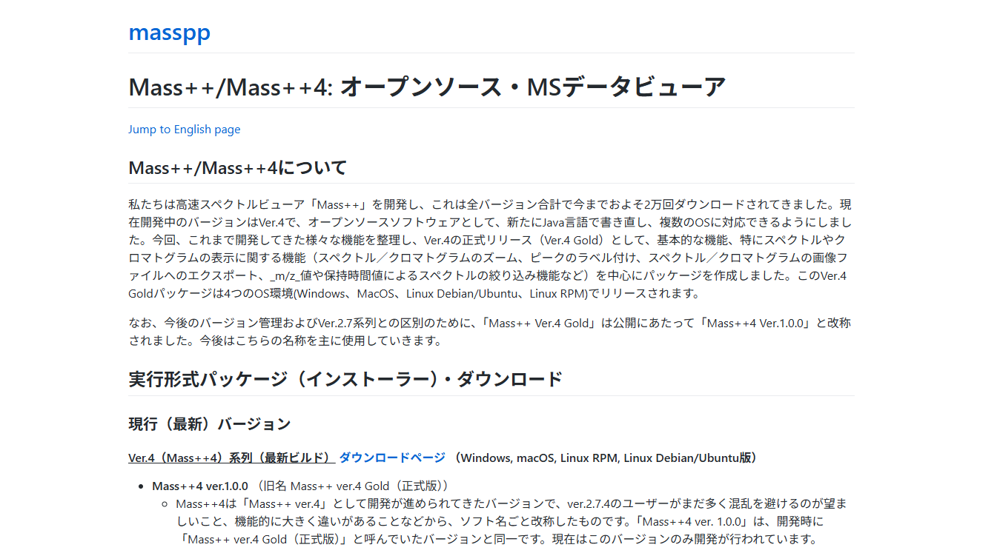
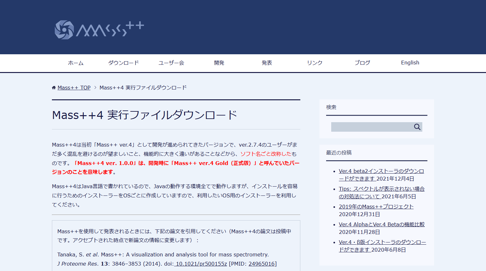

#  インストール

Mass++4 は、プラットフォームごとにすぐにインストールできるパッケージで配布されて
います。パッケージには Java の実行環境が含まれているため、Java を別途インストール
する必要は**ありません**。

##  インストーラのダウンロード

1. Mass++ のウェブサイト <https://mspp.ninja/> を開きます。
   英語で表示された場合は、メニューの **Japanese** をクリックすると日本語で表示
   されます。ページ上部のメニューにある **ダウンロード** をクリックします。

   

2. Mass++/Mass++4 のポータル <https://develop.mspp.ninja/README.jpn.html> が開き
   ます。**実行形式パッケージ（インストーラー）・ダウンロード** ->
   **現行（最新）バージョン** に進み、*Ver.4（Mass++4）系列（最新ビルド）* の
   **ダウンロードページ** リンクをクリックします。

   

3. [Mass++4 実行ファイルダウンロード](https://mspp.ninja/mass4-%e5%ae%9f%e8%a1%8c%e3%83%95%e3%82%a1%e3%82%a4%e3%83%ab%e3%83%80%e3%82%a6%e3%83%b3%e3%83%ad%e3%83%bc%e3%83%89/)
   ページが開きます。ページの冒頭には、Mass++ を使った結果を発表するときに引用する
   論文も記載されています。

   

4. 下にスクロールして **インストーラーのダウンロード** に進み、最新版から、お使いの
   プラットフォームのパッケージの **ダウンロード** ボタンをクリックします。

| プラットフォーム | ページ上のパッケージ | 形式 |
| --- | --- | --- |
| Windows | `Mass++4 <version> (Windows)` | `.zip`（`.exe` を圧縮したもの） |
| macOS | `Mass++4 <version> (MacOS)` | `.dmg` |
| Debian / Ubuntu | `Mass++4 <version> (Linux-Debian/Ubuntu)` | `.deb` |
| RHEL / AlmaLinux などの RPM 系ディストリビューション | `Mass++4 <version> (Linux-RPM)` | `.rpm` |

古いビルドは、同じページのさらに下にある *【Mass++4インストーラー・過去のバージョン】*
に、Mass++ ver.2 は別のダウンロードページにあります。どちらもこのマニュアルの対象外
です。

同じインストーラは、ソースリポジトリのリリースにも添付されています。
<https://github.com/masspp/mspp4-desktop/releases>

##  Windows

1. ダウンロードした `.zip` ファイルを展開します。
2. 中に入っているインストーラ（`.exe`）を実行します。
3. インストーラでインストール先のフォルダを選べます。スタートメニューの項目と
   デスクトップのショートカットが作成されます。
4. スタートメニューの **Mass++4** から起動します。

##  macOS

1. ダウンロードした `.dmg` ファイルを開きます。
2. **Mass++4** を `Applications`（アプリケーション）フォルダにドラッグします。
3. `Applications` フォルダから起動します。

「開発元を確認できない」ためにアプリケーションを開けないと macOS に表示された場合は、
アプリケーションのアイコンを右クリックして `Open`（開く）を選び、確認してください。

##  Debian / Ubuntu

ダウンロードしたパッケージをインストールします。`<version>` は、ファイル名に含まれる
バージョンに置き換えてください。

```bash
sudo apt install ./ms++4_<version>_amd64.deb
```

##  RHEL / AlmaLinux

ダウンロードしたパッケージをインストールします。`<version>` はファイル名に含まれる
バージョンに置き換え、お使いのメジャーバージョン（`alma9` または `alma10`）の
パッケージを使ってください。

```bash
sudo dnf install ./ms++4-<version>-1.alma9.x86_64.rpm
```

##  ベンダーの生データを開く場合

`.mzML` ファイルは、そのまま読み込めます。Thermo `.raw`、Sciex `.wiff`、Shimadzu
`.lcd` ファイルを開くには、さらに **Docker Desktop** をインストールして起動しておく
必要があります。Mass++4 は、これらのファイルを Docker コンテナ内の ProteoWizard
`msconvert` で mzML に変換するためです。

<https://www.docker.com/products/docker-desktop/>

初回の変換では変換用のイメージをダウンロードするため、2 回目以降より時間がかかり
ます。Docker が起動していない状態でこれらのファイルを開くと、Docker Desktop を起動
するよう求めるメッセージが表示されます。

##  ソースからのビルド

インストーラを使わずに Mass++4 を自分でビルドする場合は、`mspp4-desktop`
リポジトリの手順に従ってください。

<https://github.com/masspp/mspp4-desktop#how-to-develop>
