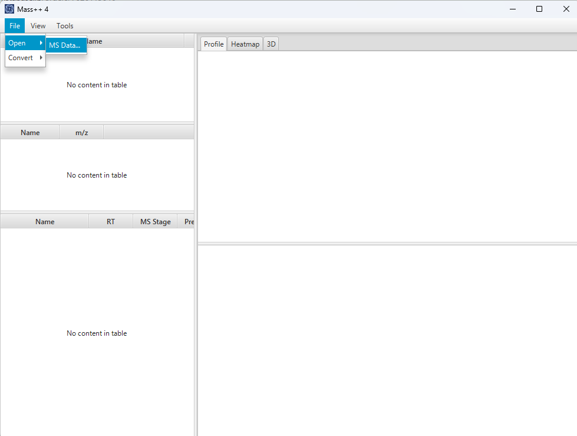
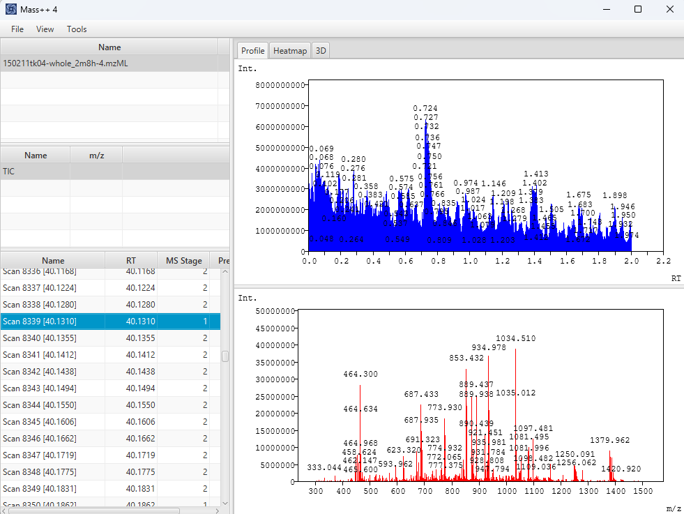
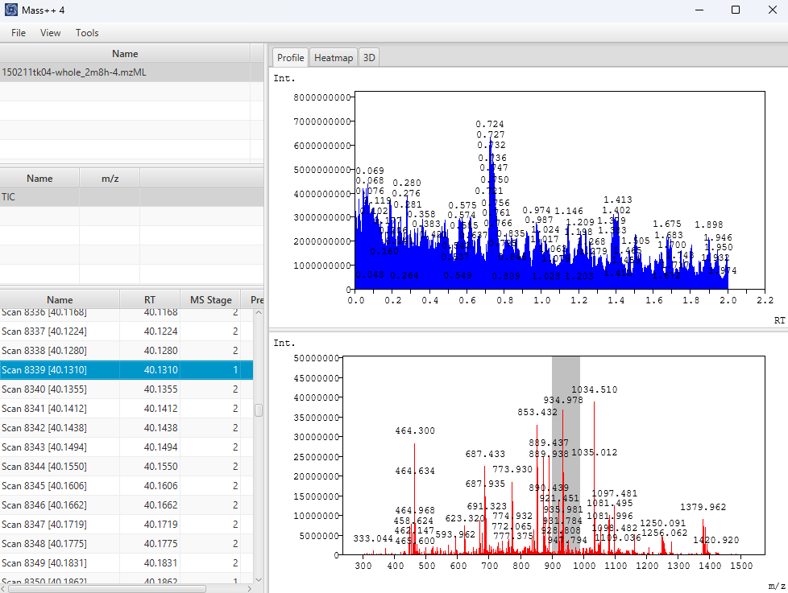
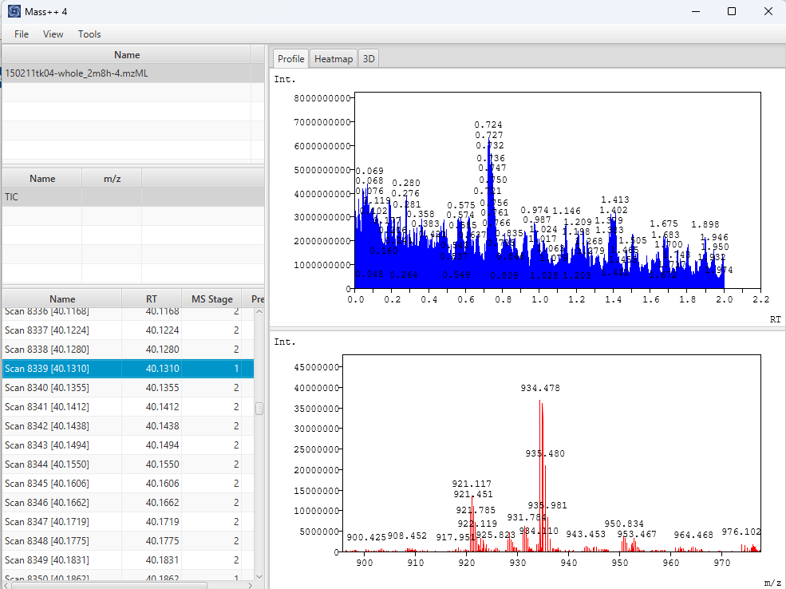
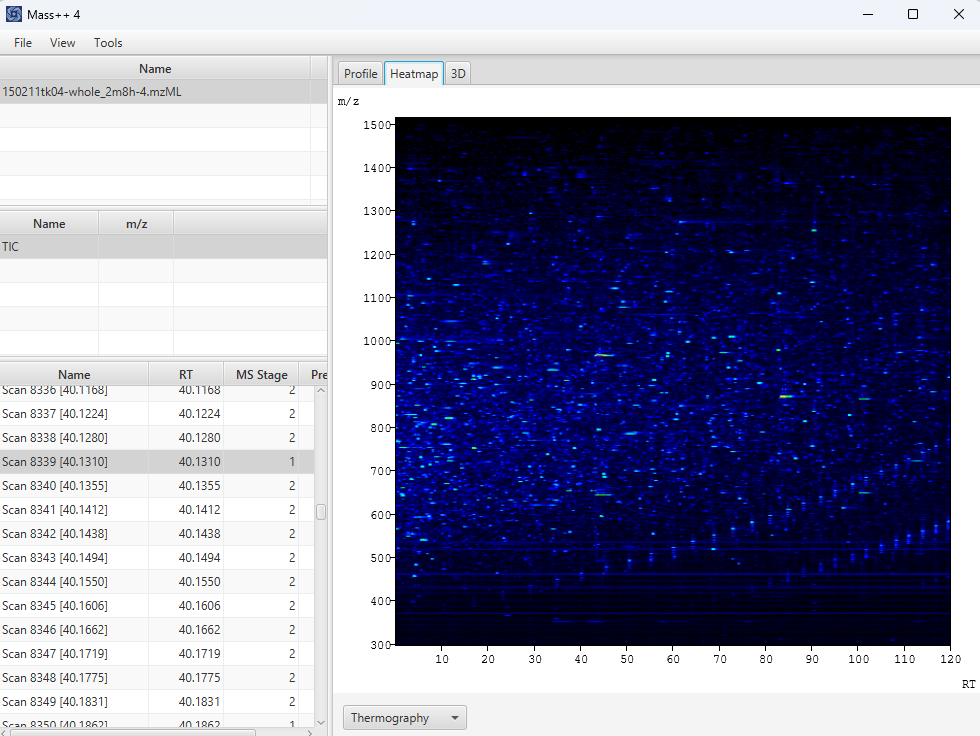
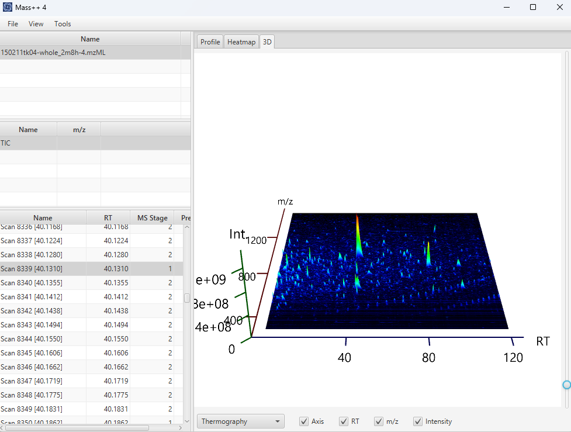

#  Opening an mzML file

##  Opening the file

1. Choose **File** -> **Open** -> **MS Data...** from the menu bar.

   

2. Select an `.mzML` file in the file dialog and click `Open`.
   The dialog starts in the folder you used the last time.
3. A progress dialog is shown while the file is read. Large files take a while.

##  Chromatogram and spectrum

The main window is divided into the tables on the left and the graphs on the
right.

The tables list, from top to bottom:

| Table | Columns |
| --- | --- |
| Sample | `Name` |
| Chromatogram | `Name`, `m/z` |
| Spectrum | `Name`, `RT`, `MS Stage`, `Precursor` |

- The opened file is listed in the **Sample** table. When it is the first file
  you open, it is selected automatically. Otherwise, click it to show its
  chromatograms and spectra.
- Click a row of the **Chromatogram** table to draw that chromatogram in the
  upper graph of the **Profile** tab. The horizontal axis is the retention time
  (`RT`), and the vertical axis is the intensity (`Int.`).
- Click a row of the **Spectrum** table to draw that spectrum in the lower
  graph. The horizontal axis is `m/z`, and the vertical axis is the intensity.
- The positions of the detected peaks are written above the peaks.
- If the mzML file contains no chromatogram, a TIC (total ion current)
  chromatogram is calculated from the spectra and listed instead.

##  Zooming

Drag left or right inside a chromatogram or a spectrum. The dragged range is
shown in gray.

When you release the mouse button, the graph zooms into that range. The
intensity axis is scaled automatically to the peaks of the displayed range.

You can repeat this to zoom in further. Double-click inside the graph to reset
the zoom and show the whole range again.

##  Panning

Once a graph is zoomed in, drag the area **below the horizontal axis** to scroll
the displayed range to the left or right, without changing its width. The mouse
cursor becomes a hand there. Panning stops at the ends of the data.

##  Heatmap

The **Heatmap** tab shows the whole sample as a map of retention time
(horizontal) and m/z (vertical), where the color of each position represents
the intensity.

The map is calculated in the background when the sample is selected, so it may
take a moment to appear. It is drawn from the MS spectra that have a retention
time, and needs at least two of them.

- Drag a rectangle to zoom into that retention time and m/z region.
- Double-click to go back to the previous region.
- Choose the color scheme (for example **Thermography**) from the list below the
  map.

##  3D view

The **3D** tab shows the same retention time, m/z and intensity data as a
three-dimensional surface.

- Drag to rotate: dragging sideways turns the surface, and dragging up or down
  tilts it.
- Use the slider on the right edge to move closer to or further away from the
  surface.
- The **Axis**, **RT**, **m/z** and **Intensity** check boxes below the view show
  and hide the axis and its labels.
- Choose the color scheme from the list at the lower left.
