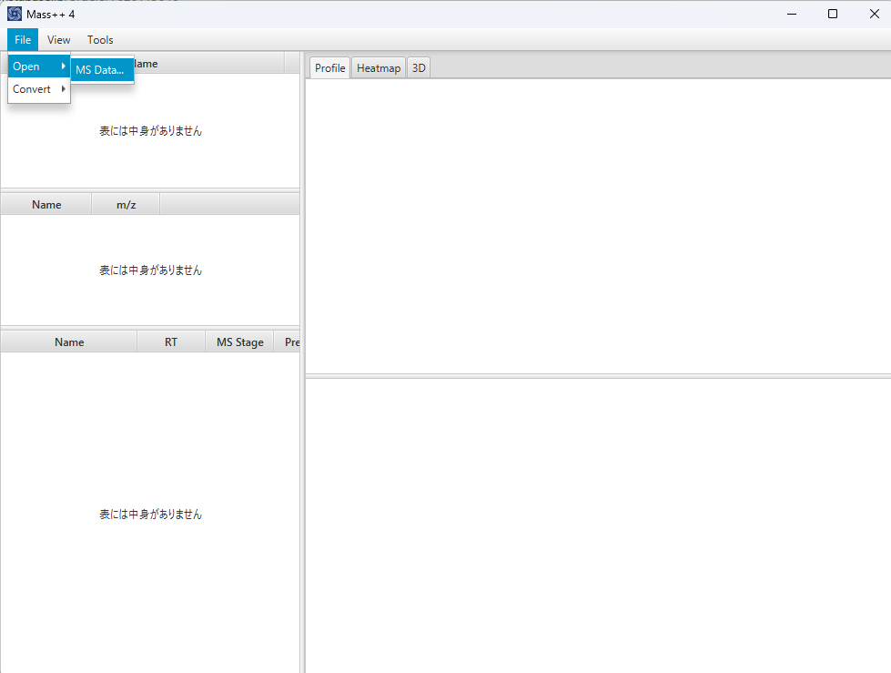

#  mzML ファイルを開く

##  ファイルを開く

1. メニューバーから **File** -> **Open** -> **MS Data...** を選びます。

   

2. ファイルダイアログで `.mzML` ファイルを選び、`Open`（開く）をクリックします。
   ダイアログは、前回使ったフォルダで開きます。
3. ファイルの読み込み中は、進捗ダイアログが表示されます。大きなファイルは時間が
   かかります。

##  クロマトグラムとスペクトル

メインウィンドウは、左側のテーブルと右側のグラフに分かれています。

テーブルは、上から順に次のとおりです。

| テーブル | 列 |
| --- | --- |
| Sample | `Name` |
| Chromatogram | `Name`、`m/z` |
| Spectrum | `Name`、`RT`、`MS Stage`、`Precursor` |

- 開いたファイルは **Sample** テーブルに表示されます。最初に開いたファイルは自動で
  選択されます。それ以外の場合は、クリックするとそのクロマトグラムとスペクトルが
  表示されます。
- **Chromatogram** テーブルの行をクリックすると、**Profile** タブの上段にその
  クロマトグラムが描画されます。横軸は保持時間（`RT`）、縦軸は強度（`Int.`）です。
- **Spectrum** テーブルの行をクリックすると、下段にそのスペクトルが描画されます。
  横軸は `m/z`、縦軸は強度です。
- 検出されたピークの位置が、ピークの上に表示されます。
- mzML ファイルにクロマトグラムが含まれていない場合は、スペクトルから TIC（トータル
  イオンカレント）クロマトグラムが計算され、代わりに一覧に表示されます。

##  ズーム

クロマトグラムまたはスペクトルの中で、左右にドラッグします。ドラッグした範囲が灰色
で表示されます。

マウスボタンを離すと、その範囲に拡大されます。強度の軸は、表示範囲のピークに合わせ
て自動で調整されます。

繰り返しドラッグして、さらに拡大することもできます。グラフの中でダブルクリックする
と拡大が解除され、全体が表示されます。

##  パン

拡大した状態で**横軸の下の領域**をドラッグすると、表示範囲の幅を変えずに左右へ
スクロールできます。その領域では、マウスカーソルが手の形になります。データの端で
それ以上は動きません。

##  ヒートマップ

**Heatmap** タブでは、サンプル全体を保持時間（横軸）と m/z（縦軸）のマップとして
表示します。各位置の色が強度を表します。

マップはサンプルを選択したときにバックグラウンドで計算されるため、表示されるまで
少し時間がかかることがあります。保持時間を持つ MS スペクトルから描画され、2 本以上
必要です。

- 矩形をドラッグすると、その保持時間と m/z の領域に拡大されます。
- ダブルクリックすると、1 つ前の領域に戻ります。
- マップの下のリストから配色（例：**Thermography**）を選べます。

##  3D 表示

**3D** タブでは、同じ保持時間・m/z・強度のデータを 3 次元の曲面として表示します。

- ドラッグすると回転します。左右のドラッグで曲面が回り、上下のドラッグで傾きます。
- 右端のスライダーで、曲面に近づいたり遠ざかったりできます。
- 表示の下にある **Axis**、**RT**、**m/z**、**Intensity** のチェックボックスで、
  軸とそのラベルの表示・非表示を切り替えます。
- 左下のリストから配色を選べます。
