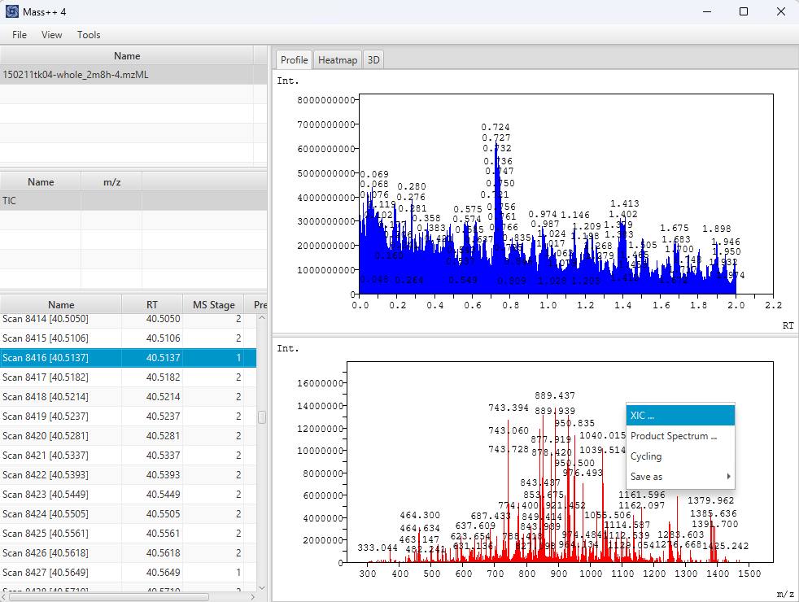
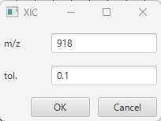
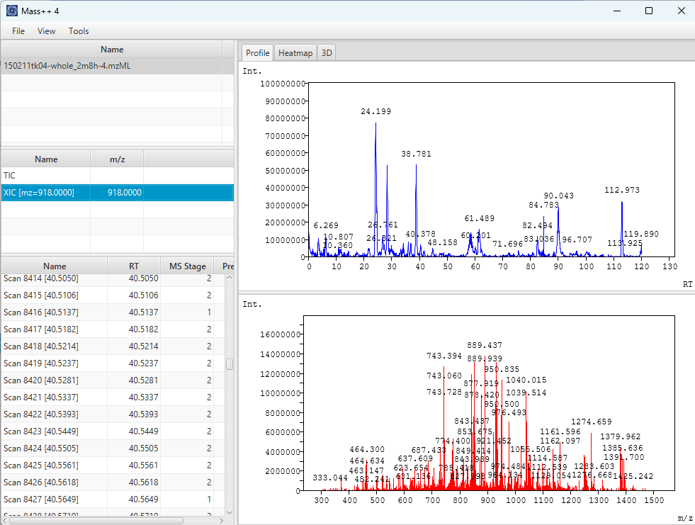
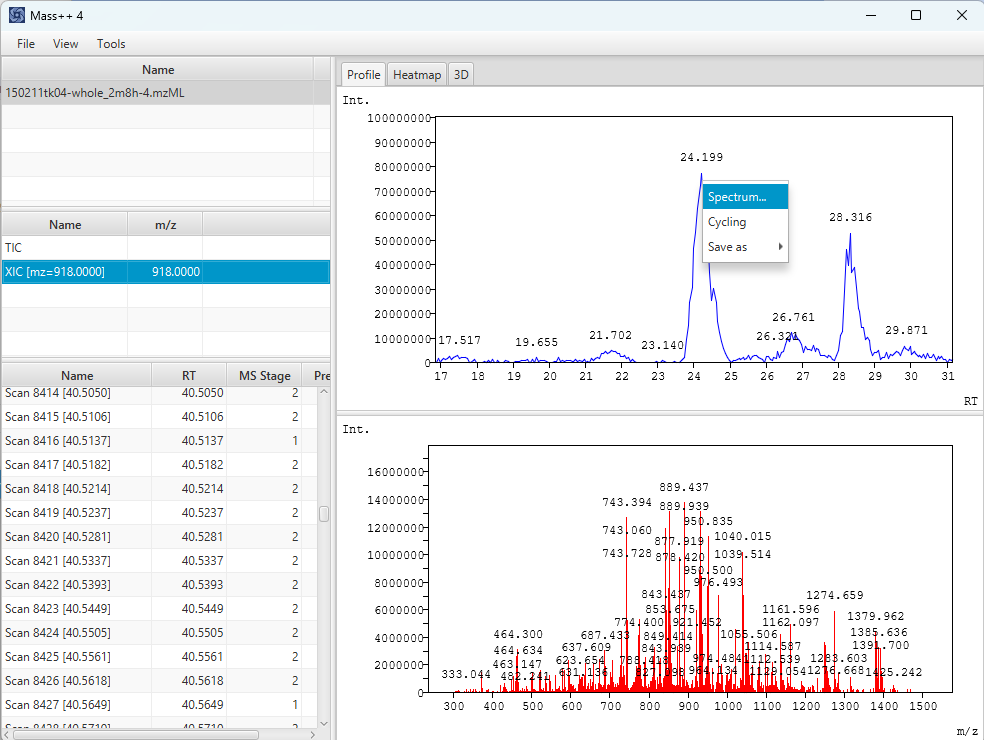
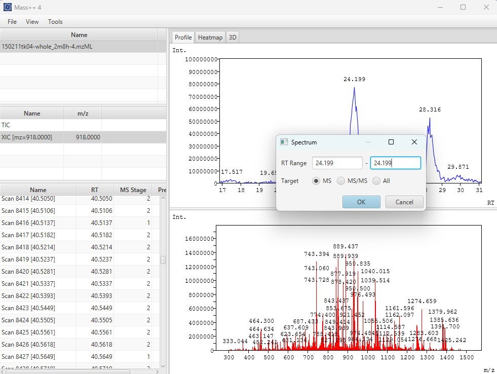

#  TIC, XIC and Spectrum Navigation

This chapter assumes that an mzML file is already opened, as described in
[Opening an mzML file](02_Opening_mzML.md).

##  TIC

The TIC (total ion current) chromatogram shows the total intensity of the MS
spectra along the retention time. It gives an overview of when ions were
detected during the measurement.

- If the mzML file contains chromatograms, such as a TIC, they are listed in
  the **Chromatogram** table.
- If the file contains no chromatogram, Mass++4 calculates a TIC from the MS
  spectra and lists it as **TIC**.

Click the row in the **Chromatogram** table to draw it in the upper graph of the
**Profile** tab.

##  XIC

An XIC (extracted ion chromatogram) shows the intensity of a single m/z along
the retention time. Use it to see when a particular ion was detected.

1. Draw a spectrum that contains the ion you are interested in.
2. Right-click the peak in the spectrum and choose **XIC ...**.

   

3. In the **XIC** dialog, check or edit the values and click **OK**.

   

   | Field | Meaning | Initial value |
   | --- | --- | --- |
   | `m/z` | Center of the m/z range | The m/z you right-clicked |
   | `tol.` | Half width of the m/z range | `0.1` |

The XIC is added to the **Chromatogram** table as `XIC [mz=<m/z>]` and drawn in
the upper graph. For each MS spectrum, the intensities within `m/z` ± `tol.` are
summed. MS/MS spectra are not used.

The XIC stays in the **Chromatogram** table while the file is open, so you can
create several XICs and switch between them in the table.

##  Moving between spectra

###  Using the Spectrum table

Click a row of the **Spectrum** table to draw that spectrum. Each row shows the
scan number and the retention time in its name, for example
`Scan 8416 [40.5137]`.

After clicking a row, you can press the **Up** and **Down** arrow keys to move
to the previous or next spectrum. The graph follows the selection.

###  From a chromatogram

You can open the spectrum at a position of a chromatogram, such as a peak of an
XIC.

1. Right-click the chromatogram at the retention time you are interested in,
   and choose **Spectrum...**.

   

2. In the **Spectrum** dialog, set the values and click **OK**.

   

   | Field | Meaning | Initial value |
   | --- | --- | --- |
   | `RT Range` | Retention time range of the spectra to show | The retention time you right-clicked, as both the start and the end |
   | `Target` | `MS`, `MS/MS` or `All` spectra | `MS` |

The spectrum that is drawn depends on how many spectra of the target are in the
range:

| Spectra in the range | Result |
| --- | --- |
| Two or more | Their average spectrum |
| One | That spectrum |
| None | The spectrum closest to the range |

With the initial values, the range contains no spectrum in most cases, so
clicking **OK** directly shows the spectrum closest to the retention time you
right-clicked. Widen the range, for example to cover a whole peak, to average
its spectra.

When averaging, profile spectra are interpolated onto a common m/z axis before
their intensities are averaged. For centroid spectra, the intensities at the
same m/z are summed and divided by the number of spectra.

###  Precursor and product spectra

For data measured with MS/MS, you can move between a precursor spectrum and its
product spectra from the right-click menu of the spectrum.

- **Precursor Spectrum**: shown when the drawn spectrum is a product spectrum.
  It draws the precursor spectrum.
- **Product Spectrum ...**: shown when the drawn spectrum has product spectra.
  Choose one of them in the dialog to draw it. Each item is shown as
  `Scan <number> (rt = <retention time>, precursor=<precursor m/z>)`.
