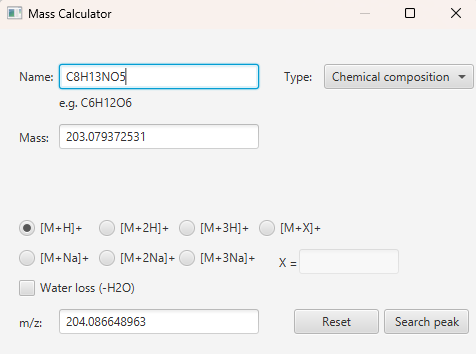
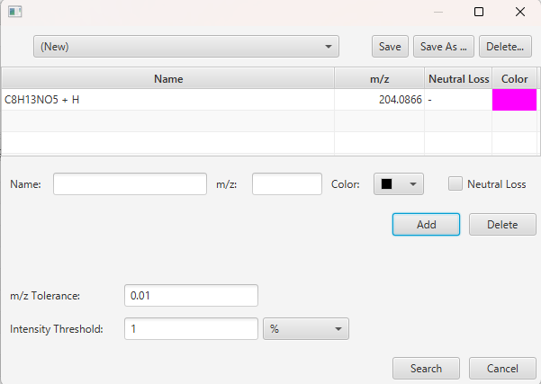
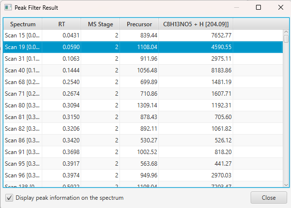
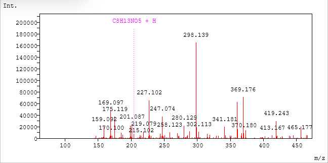
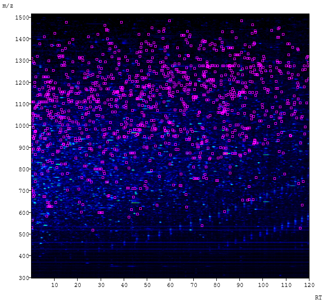

#  具体的な組成式を使ったピークフィルタ

Peak Filter は、指定した m/z にピークを持つ MS/MS スペクトルを探す機能です。この章
では、1 つの具体例を使って、組成式から結果の確認までを順に説明します。

**例**：糖ペプチドに特徴的なフラグメントイオンである、HexNAc オキソニウムイオンを
含む MS/MS スペクトルを探します。

| 項目 | 値 |
| --- | --- |
| 組成式 | `C8H13NO5` |
| イオン | `[M+H]+` |
| m/z | `204.086648963` |

この章は、[mzML ファイルを開く](02_Opening_mzML_ja.md)の手順で mzML ファイルを開き、
そのサンプルを選択していることを前提にしています。Peak Filter は、選択中のサンプル
のスペクトルを検索します。

##  手順 1：組成式から m/z を計算する

1. **Tools** -> **Mass Calculator...** を選びます。
2. **Type** を **Chemical composition** にします。
3. **Name** に `C8H13NO5` と入力します。
   **Mass** に中性質量 `203.079372531` が表示されます。
4. **[M+H]+** を選んだまま、**Water loss (-H2O)** はチェックしないでおきます。
   **m/z** に `204.086648963` が表示されます。

組成式を解釈できない場合は、**Mass** の下に赤字でメッセージが表示され、値は空に
なります。

**Type** を **Glycan composition** にして `HexNAc(1)` と入力し、**Water loss
(-H2O)** をチェックしても、同じ m/z になります。

##  手順 2：m/z を Peak Filter に追加する

1. **Mass Calculator** で **Search peak** をクリックします。
   **Name** に `C8H13NO5 + H`、**m/z** に `204.086648963` が入った状態で
   **Peak Filter** ダイアログが開きます。
2. **Color** で、ピークの目印に使う色を選びます。
3. **Add** をクリックします。ピークがダイアログ上部の表に追加され、次のピークを
   入力できるように入力欄が空になります。

**Tools** -> **Peak Filter...** からダイアログを開き、**Name** と **m/z** を直接入力
することもできます。複数のイオンを同時に検索するには、イオンごとに行を追加します。
行を削除するには、行を選んで **Delete** をクリックします。

##  手順 3：検索する

1. ダイアログ下部に検索条件を入力します。どちらの欄も最初は空で、入力が必要です。

   | 項目 | 意味 | 例 |
   | --- | --- | --- |
   | **m/z Tolerance** | m/z からの許容差（m/z 単位） | `0.01` |
   | **Intensity Threshold** | ピークの強度の最小値 | `1`（`%`） |

   **Intensity Threshold** の単位は、`%`（各スペクトルの最も強いピークに対する割合）
   か `count`（強度の絶対値）です。
   許容差は、お使いの装置の精度に合わせて選んでください。

2. **Search** をクリックします。

検索されるのは MS/MS スペクトル（MS Stage 2 以上）だけです。**m/z** ±
**m/z Tolerance** の範囲に、しきい値以上の強度のピークがあるスペクトルがヒット
します。

##  手順 4：結果を確認する

**Peak Filter Result** ダイアログに、ヒットしたスペクトルが一覧表示されます。

| 列 | 内容 |
| --- | --- |
| `Spectrum` | スペクトル |
| `RT` | 保持時間 |
| `MS Stage` | MS ステージ |
| `Precursor` | プリカーサーの m/z |
| ピークごとの列（ピークの名前と m/z が列名） | 一致したピークの強度 |

行をクリックすると、そのスペクトルが描画されます。ピークの m/z の位置に、選んだ色で
点線とピークの名前が表示されます。

目印を消すには、**Display peak information on the spectrum** のチェックを外します。

**Heatmap** タブでは、ヒットしたスペクトルのプリカーサーの位置に、同じ色の小さな
四角が表示されます。ヒットしたスペクトルのプリカーサーが、保持時間と m/z のどこに
あるかがわかります。

**Close** をクリックすると、結果を閉じます。

##  ピークリストを保存して再利用する

**Peak Filter** ダイアログのピークは、名前を付けたセットとして保存し、再利用でき
ます。ダイアログ上部のリストには、選択中のセットが表示されます。セットを選んで
いないときは `(New)` と表示されます。

- **Save As ...**：ピークを新しいセットとして保存します。名前を聞かれたら入力します。
- **Save**：選択中のセットを上書きします。セットを選んでいないときは、
  **Save As ...** と同じ動作になります。
- リストでセットを選ぶと、そのピークが読み込まれます。表のピークは置き換えられます。
- **Delete...**：確認のうえ、選択中のセットを削除します。
