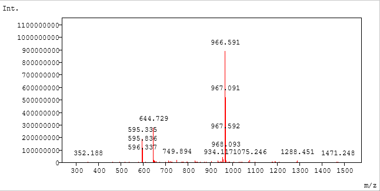
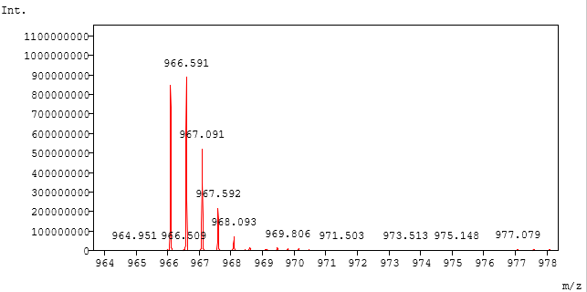
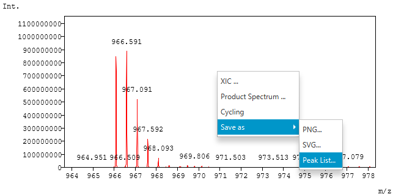

#  ピーク検出

Mass++4 は、スペクトルやクロマトグラムを描画するときに、自動でピークを検出します。
事前の設定は不要で、検出したピークはグラフ上のラベルとピークリストの保存に使われ
ます。

この章は、[mzML ファイルを開く](02_Opening_mzML_ja.md)の手順で mzML ファイルを開いて
いることを前提にしています。

##  ピークが検出されるタイミング

ピークは、**Spectrum** テーブルや **Chromatogram** テーブルの行をクリックするなど
して、スペクトルやクロマトグラムを初めて選んだときに検出されます。結果はファイルを
開いている間保持されるので、同じデータをもう一度選んでも、再度検出はされません。

##  ピークの検出方法

###  profile スペクトルとクロマトグラム

すべてのデータ点を、ピークの頂点の候補として調べます。

1. 頂点から、両側の点を外側に向かってたどります。
2. 頂点と同じ高さ以上の点に先に当たった場合、その点はピークではありません。
3. 両側で強度が**頂点の半分**を下回った場合、その点はピークです。

各ピークについて、次の値を記録します。

| 値 | 計算方法 |
| --- | --- |
| 位置（m/z または RT） | 頂点の半分より上にある点の重み付き重心。重みは、半分の高さからどれだけ上にあるか |
| 強度 | 頂点の強度 |
| 開始 / 終了 | 左右それぞれで、最初に頂点の半分を下回った点 |

位置は重み付き重心なので、2 つのデータ点の間になることもあり、最も高いデータ点の
位置より精度が高くなります。

###  centroid スペクトル

centroid スペクトルは、すでにピークの集まりです。強度が 0 より大きいすべてのデータ
点をピークとし、位置・開始・終了には同じ値を使います。

##  ピークラベル

検出したピークの位置は、グラフのピークの上に小数 3 桁で表示されます。スペクトルでは
m/z、クロマトグラムでは保持時間です。



- ラベルは、強度の高いピークから順に配置されます。
- すでに配置されたラベルと重なるラベルは表示されません。そのため、広い範囲を表示
  しているときは、主なピークにだけラベルが付きます。
- 小さいピークのラベルを見るには、[mzML ファイルを開く](02_Opening_mzML_ja.md#ズーム)
  の手順で拡大してください。



この拡大したスペクトルでは、`966.591` のすぐ左にある背の高いピークにラベルがあり
ません。そのラベルが、先に配置された `966.591` のラベルと重なるためです。

##  ピークリストの保存

1. スペクトルまたはクロマトグラムを右クリックし、**Save as** -> **Peak List...** を
   選びます。
   ピークが検出されていない場合、この項目は選べません。

   

2. ファイル名とファイルの種類を選び、`Save`（保存）をクリックします。

| ファイル名 | 形式 |
| --- | --- |
| `*.csv` | カンマ区切り |
| `*.txt` | タブ区切り |

ファイル名にどちらの拡張子も付いていない場合は、選んだファイルの種類の拡張子が付け
られます。

ファイルは UTF-8 で、ピークを位置の順に並べ、次の列で書き出されます。

| 列 | 内容 |
| --- | --- |
| `m/z` または `RT` | ピークの位置 |
| `Intensity` | ピークの強度 |
| `Start` | ピークの開始位置 |
| `End` | ピークの終了位置 |
| `Annotation` | ピークのアノテーション（ある場合） |

CSV ファイルの例：

```text
m/z,Intensity,Start,End,Annotation
100.5,300.0,100.4,100.6,
500.25,1200.0,500.1,500.4,
```
