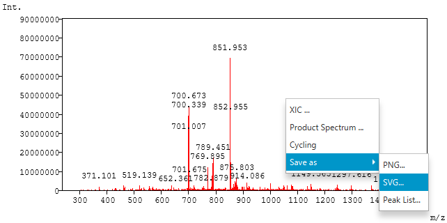

#  SVG Export

A spectrum or a chromatogram can be saved as an SVG file. SVG is a vector
format, so the drawing stays sharp at any size and can be edited in drawing
software such as Inkscape or Adobe Illustrator. Use it for figures in papers,
posters and slides.

This chapter assumes that a spectrum or a chromatogram is drawn, as described in
[Opening an mzML file](02_Opening_mzML.md).

##  Saving a graph as SVG

1. Show the graph the way you want to save it: select the spectrum or the
   chromatogram, and zoom into the range you need.
2. Right-click the graph and choose **Save as** -> **SVG...**.

   

3. In the **Save SVG File** dialog, choose the folder, enter a file name ending
   with `.svg`, and click `Save`.

##  What is saved

The SVG file contains the graph as it is currently shown.

| Item | In the SVG file |
| --- | --- |
| Displayed range | The zoomed range, not the whole data |
| Waveform | Drawn as many short line segments |
| Axes, tick labels and titles | Included; the text is kept as text in a monospace font |
| Peak labels | Included, as shown on the screen |
| Marks of the peak filter | Included, when they are shown on the screen |
| Size | Width and height of the graph on the screen, in pixels |
| Background | Transparent |

Because the size of the file follows the size of the graph on the screen, resize
the Mass++4 window before saving to change the aspect ratio of the figure. The
size can also be changed later in the drawing software without losing quality.

The background is transparent. When you place the figure on a colored
background, add a white rectangle behind it in the drawing software if needed.

##  Editing the SVG file

- The tick labels, axis titles and peak labels are text elements, so you can
  change their font, size and content in the drawing software.
- The waveform consists of many line segments. Select them together, for example
  by grouping them, to change their color or line width at once.

##  SVG or PNG

The same **Save as** menu also offers **PNG...**.

| | SVG | PNG |
| --- | --- | --- |
| Format | Vector | Bitmap |
| Enlarging | Stays sharp | Becomes blurry |
| Editing text and lines | Possible in drawing software | Not possible |
| Typical use | Papers, posters, figures to edit | Quick sharing, documents and web pages |
