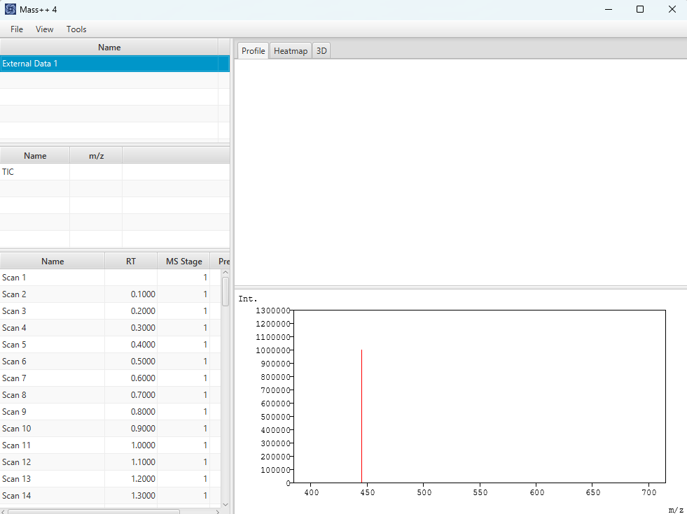
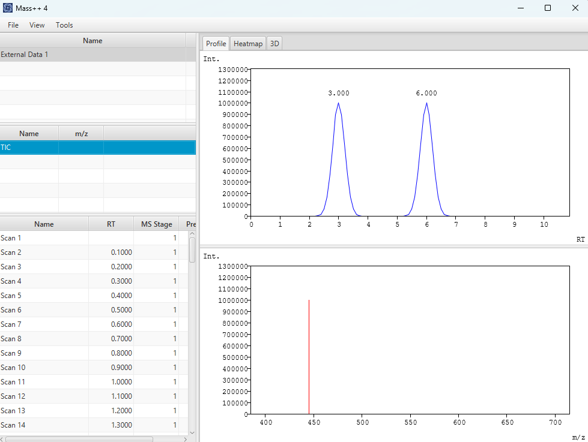
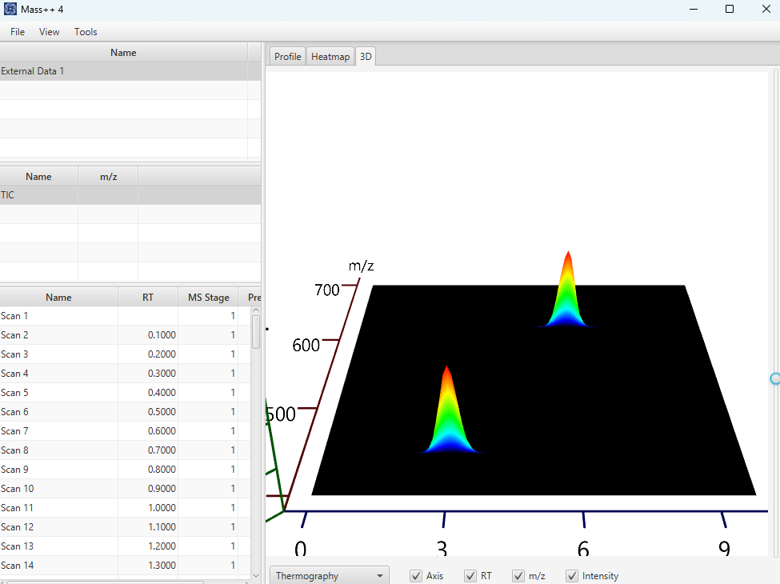

#  Python MS Data Link Example

Mass++4 has a small HTTP API, so that other programs can exchange spectra with
it. This chapter shows how to use it from Python in both directions:

- **Python -> Mass++4**: send spectra made in Python and view them in Mass++4.
- **Mass++4 -> Python**: read the spectra of the sample selected in Mass++4 and
  process them in Python.

The API and more examples are published in the
[api-sample](https://github.com/masspp/api-sample) repository.

##  Requirements

- **Mass++4 is running.** The API starts automatically with Mass++4 and waits
  for requests on port `8191`.
- **Python 3** with `requests` and `numpy`:

  ```bash
  pip install requests numpy
  ```

The API has no authentication, and the port can also be reached from other
computers on the network. Use it on a trusted network, and block port `8191` in
your firewall if other computers do not need it.

##  How the API works

- Every service is called with `POST http://localhost:8191/<service name>`.
- The request body is JSON. Send `null` when a service takes no parameters.
- The response is a JSON document wrapped in a JSON string, for example
  `"{\"index\":\"0\"}"`, so it has to be decoded twice. Numbers in responses
  can also be strings, such as `"0"`.

| Service | Parameters | Result |
| --- | --- | --- |
| `io_create_sample` | `null` | Creates a sample to send spectra to, and returns its `id` |
| `io_add_scan` | A spectrum (see below) | Adds the spectrum to the sample |
| `io_add_annotation` | A list of annotations | Adds structure images to be drawn above peaks |
| `io_flush` | `id` and `index` | Opens the sample in Mass++4 and draws the spectrum at `index` |
| `io_get_spectra_count` | `null` | Number of spectra in the selected sample |
| `io_get_current_index` | `null` | Index of the spectrum selected in the **Spectrum** table |
| `io_get_spectrum` | `index` (as a string) | The spectrum at `index` in the selected sample |

##  A helper function

Save the following as `masspp_api.py`. The examples below use it to call the
services. It works the same way as `call_service` in `common_ms_utils.py` of
api-sample.

```python
import json

import requests

BASE_URL = 'http://localhost:8191/'


def call_service(name, data=None):
    """Calls a Mass++4 service and returns the decoded JSON response."""
    response = requests.post(
        BASE_URL + name,
        headers={'Content-Type': 'application/json'},
        data=json.dumps(data),
    )
    response.raise_for_status()
    if not response.text.strip():
        raise RuntimeError(f'{name} returned an empty response')
    result = response.json()
    # Mass++4 returns the JSON document as a JSON string, so decode it once more.
    if isinstance(result, str):
        result = json.loads(result)
    return result
```

##  Example 1: Send spectra from Python to Mass++4

This example makes a small LC-MS data set with two compounds and sends it to
Mass++4. Save it as `send_spectra.py` next to `masspp_api.py`.

| Compound | m/z | Retention time |
| --- | --- | --- |
| 1 | `445.10` | 3.0 min |
| 2 | `622.05` | 6.0 min |

```python
import numpy as np

from masspp_api import call_service

# Two compounds: (m/z, retention time in minutes)
COMPOUNDS = [(445.10, 3.0), (622.05, 6.0)]

mz = np.round(np.arange(400.0, 700.0, 0.05), 2)
rts = np.round(np.arange(0.0, 10.0, 0.1), 1)

sample_id = call_service('io_create_sample')['id']

for rt in rts:
    intensity = np.zeros_like(mz)
    for peak_mz, peak_rt in COMPOUNDS:
        height = 1.0e6 * np.exp(-((rt - peak_rt) / 0.3) ** 2)
        intensity += height * np.exp(-((mz - peak_mz) / 0.02) ** 2)

    call_service('io_add_scan', {
        'id': sample_id,
        'msLevel': 1,
        'precursorMz': -1.0,
        'rt': float(rt),
        'centroidMode': False,
        'minMz': 400.0,
        'maxMz': 700.0,
        'points': [{'x': float(x), 'y': float(y)} for x, y in zip(mz, intensity)],
    })

# Open the sample in Mass++4 and draw the spectrum at index 30 (RT 3.0).
call_service('io_flush', {'id': sample_id, 'index': 30})
print(f'Sent {len(rts)} spectra as sample {sample_id}')
```

Run it while Mass++4 is running:

```bash
python send_spectra.py
```

It sends 100 spectra in a few seconds.

###  What happens in Mass++4

The data appear in the **Sample** table as `External Data 1`. The number
increases each time you send data. When it is the first sample opened in
Mass++4, it is selected automatically, and the spectrum at index `30` (RT 3.0)
is drawn with the peak of compound 1 at m/z 445.1.



Peaks of the spectra sent through the API are not picked automatically, so no
peak labels are drawn on these spectra.

A TIC is calculated from the spectra and listed in the **Chromatogram** table.
Click it to draw the two compounds at 3.0 and 6.0 min.



The **Heatmap** and **3D** tabs work in the same way as for an opened file. The
**3D** tab shows the two compounds as two peaks.



###  Fields of a spectrum

| Field | Meaning |
| --- | --- |
| `id` | ID of the sample returned by `io_create_sample` |
| `msLevel` | MS stage: `1` for MS, `2` for MS/MS |
| `precursorMz` | Precursor m/z, or `-1.0` for MS spectra |
| `rt` | Retention time, in minutes |
| `centroidMode` | `true` for centroid data, `false` for profile data |
| `minMz`, `maxMz` | m/z range of the spectrum |
| `points` | Data points as a list of `{"x": m/z, "y": intensity}` |

In `io_flush`, `index` is the position of the spectrum to draw, counted from `0`
in the order the spectra were sent.

##  Example 2: Read spectra from Mass++4 into Python

This example reads all spectra of the selected sample and saves the base peak,
the most intense data point, of each spectrum to a CSV file. Save it as
`read_spectra.py`.

```python
import csv

from masspp_api import call_service

count = int(call_service('io_get_spectra_count')['count'])
print(f'The selected sample has {count} spectra')

with open('base_peaks.csv', 'w', newline='') as f:
    writer = csv.writer(f)
    writer.writerow(['index', 'MS level', 'RT', 'base peak m/z', 'base peak intensity'])
    for index in range(count):
        spectrum = call_service('io_get_spectrum', {'index': str(index)})
        points = spectrum['points']
        if not points:
            continue
        base = max(points, key=lambda p: p['y'])
        writer.writerow([index, spectrum['msLevel'], spectrum['rt'], base['x'], base['y']])

print('Saved base_peaks.csv')
```

1. In Mass++4, select a sample in the **Sample** table. It can be a file opened
   in Mass++4 or the data sent in Example 1.
2. Run the script:

   ```bash
   python read_spectra.py
   ```

For the data sent in Example 1, `base_peaks.csv` contains the two compounds at
their retention times:

```text
index,MS level,RT,base peak m/z,base peak intensity
...
30,1,3.0,445.1,1000000.0
...
60,1,6.0,622.05,1000000.0
...
```

`io_get_spectrum` returns the same fields as in the table of Example 1. For a
large file, reading all spectra takes a while, because each spectrum is one
request.

##  More examples in api-sample

The [api-sample](https://github.com/masspp/api-sample) repository contains
more scripts. Install their packages with
`pip install -r requirements.txt`.

| Script | What it does |
| --- | --- |
| `mzXML.py` | Reads an mzXML file with pyteomics and sends its spectra to Mass++4 |
| `MoNA.py` | Downloads a spectrum from MoNA and sends it with structure images of the annotated peaks, drawn with RDKit |
| `extract.py` | Prints the MS level, RT and number of points of every spectrum in the selected sample |

##  Troubleshooting

| Symptom | Cause and solution |
| --- | --- |
| `Connection refused` | Mass++4 is not running. Start Mass++4, and check that no other program uses port `8191`. |
| `io_get_spectra_count returned an empty response` | No sample is selected. Select a sample in the **Sample** table. |
| Another service returns an empty response | A parameter is wrong, for example an unknown sample `id` or an `index` out of range. The details of the error are printed to the console output of Mass++4, which you can see when you start Mass++4 from a terminal. |
